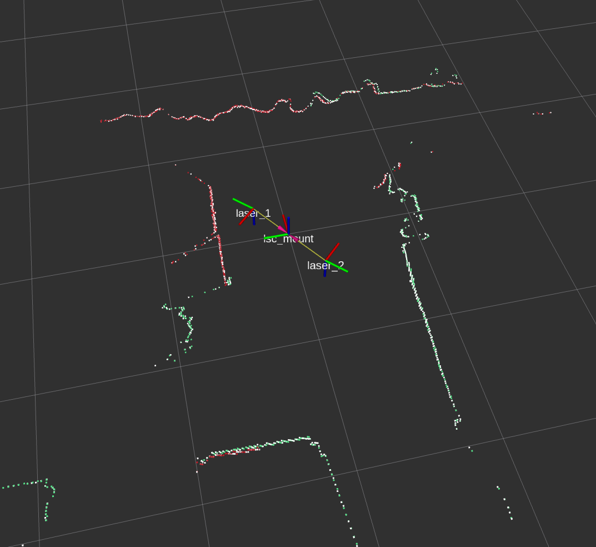

.. dual_laser_merger Documentation

dual_laser_merger Documentation
==================================

dual_laser_merger is a ROS 2 package used for merging two LaserScan topics into one LaserScan topic.

   White points are merged LaserScan, red and green points are LaserScans of individual lidars.

Contents
--------

.. toctree::
   :maxdepth: 2

   features
   usage
   parameters
   shadow_filter
   average_filter
   demo